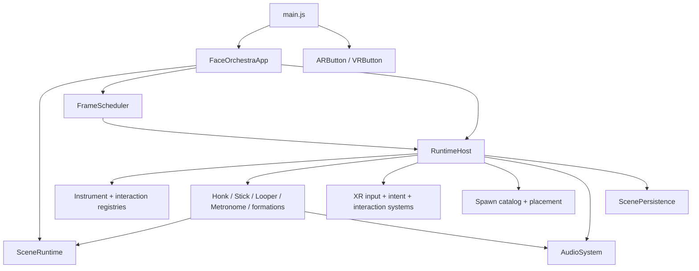

# Face Orchestra architecture

This document describes the runtime architecture as implemented. It focuses on ownership, data flow, dependency direction, frame ordering, persistence, and lifecycle behavior. User-facing setup and controls are in the [README](../README.md); hardware regression steps are in the [manual XR checklist](manual-xr-regression.md).

## Domain vocabulary and invariants

Face Orchestra has four instrument kinds:

```text
InstrumentEntity
├── HonkInstrument
├── StickInstrument
├── LooperInstrument
└── MetronomeInstrument
```

These terms are intentionally distinct:

- **Instrument kind** — `honk`, `stick`, `looper`, or `metronome`.
- **Honk tuning** — pitch, octave, note label, and snapping configuration for one Honk.
- **Formation recipe** — a spawn command whose members become independent Honks at configured offsets.
- **Contact formation** — transient runtime state: a connected component in the graph of touching Honk squeeze colliders.
- **Lock group** — a persistent stable-ID relationship with an anchor and member-relative transforms.

There is no chord instrument or composite chord entity. A recipe is not registered or persisted. An unlocked contact formation is recalculated. A lock group persists relationships between otherwise ordinary Honks.

Other invariants:

- Every instrument has a stable ID and an exact kind.
- `InstrumentRegistry` is the only authoritative instrument collection.
- Looper tracks store Honk IDs, never live Honk objects.
- Metronome connections store source/target/port IDs, never live instruments or wire meshes.
- Lock groups store member IDs, never duplicated leader/follower fields on each member.
- Three.js `userData` contains small ownership/role descriptors, not full mutable application state.
- Persistence is versioned plain JSON and contains no Three.js objects, audio nodes, functions, or class instances.
- Direct input and Looper automation remain separate layers until Honk performance resolution.
- The Stick emits events; it never mutates a Looper timeline directly.

## System context



`createFaceOrchestraApp` is the composition entry point. It constructs or accepts a `SceneRuntime` and `AudioSystem`, composes a `RuntimeHost`, and returns `FaceOrchestraApp`.

`FaceOrchestraApp` has a deliberately small lifecycle:

- `initialize()` loads runtime assets and restores the saved scene once.
- `start()` starts the scene runtime and installs the renderer animation loop.
- `update(delta, elapsed, now)` advances the frame scheduler.
- `onXRSessionStart()` applies the XR blend mode and starts session UI behavior.
- `onXRSessionEnd()` finalizes active Looper recordings, writes one scene snapshot, releases runtime interaction state, and restores the desktop environment.
- `endXRSession()` requests session termination when one exists.
- `dispose()` tears down runtime and renderer resources.

`main.js` installs the AR/VR entry button, constructs the app, calls `initialize()`, then starts the render loop. `RuntimeHost.initialize()` registers two controllers, creates the optional instruction view, loads Honk/Metronome/Looper templates plus Stick/font assets, restores persistence, and handles any already-active XR session. The committed `SHOW_INSTRUCTION_PANEL = false` path hides the panel and ensures one default Metronome exists on XR entry only when restoration supplied none. The catalog can still create any number of additional Metronomes.

Session end first suspends frame computation, then defers teardown one task so the browser and Three.js can finish dismantling the XR compositor. Runtime teardown cancels pending placement, finalizes every active Looper through its normal controller path, stops transports, writes one snapshot, releases interaction/audio state, resets transient subsystems, suspends audio, and restores the desktop environment. Persisted entities remain in the registry until explicit deletion or full application disposal.

`RuntimeHost` is the application-level dependency container and presentation bridge. It constructs the registries and domain services, wires adapters, and exposes behavior-preserving runtime methods grouped by responsibility in `src/app/runtime/`. It does not maintain a second instrument array; `instrumentStates` is a filtered view of `InstrumentRegistry`.

The runtime method slices are:

| Module | Responsibility |
| --- | --- |
| `InstrumentAssetRuntime` | Model/template loading, collider/presentation state creation, note labels, instruction view. |
| `SpawnRuntime` | Radial selection, preview behavior, placement/cancellation, duplication presentation flow. |
| `XRInteractionRuntime` | Semantic intent handlers for ray targets, grip, transforms, morph drags, lock toggles. |
| `HonkPerformanceRuntime` | Live interaction collection, playback advance, performance resolution, morph/audio application. |
| `HonkPresentationRuntime` | Honk visual/morph helpers and note-label presentation. |
| `RelationshipRuntime` | Runtime-facing lock, unlock, group visuals, and transform-following calls. |
| `StickRuntime` | Behavior-preserving Stick model/presentation helpers around the Stick domain services. |
| `LooperConnectionRuntime` | Looper/Honk wire interaction, shake disconnect, and connection presentation. |
| `LooperTransportRuntime` | Looper buttons, controls, record/play calls, and visual state. |
| `MetronomeConnectionRuntime` | Metronome port gestures and persistent clock/pulse wire presentation. |
| `MetronomePulseRuntime` | Stable anchored-Honk beat performance, transient contact-formation expansion, and cleanup. |
| `PendingSpawnSafeRuntime` | Ordered clock, automation, voice, and wire advancement while preview interactions are isolated. |
| `LifecycleRuntime` | Controller-state detachment around the central instrument deletion pipeline. |
| `SessionRuntime` | Instruction/session behavior and controller-facing session cleanup. |

## Module ownership

### Application and frame ownership

`src/app/` may compose all other layers. It owns application startup, dependency injection, session entry/exit, and frame orchestration. Domain modules do not import the app.

`FrameScheduler` owns the ordered phase list and ordered callbacks within each phase. Constructors do not hide frame callbacks; `FaceOrchestraApp.configureFramePhases()` is the readable schedule.

### Scene

`SceneRuntime` owns the scene, camera, renderer, resize handling, lighting, desktop fallback environment, XR blend-mode presentation, render call, and renderer disposal.

`AssetRepository` owns cached model, texture-set, and font loading. Asset paths are centralized in `src/config/assets.js`; cloning uses Three.js `SkeletonUtils.clone` to preserve skinned-model behavior.

`SceneRuntime` creates one antialiased, alpha-capable WebGL renderer, caps pixel ratio at 2, enables soft shadows and XR, and uses `SRGBColorSpace` for renderer output. It owns the fallback environment and hemisphere/key/fill/rim lighting. Passthrough blend modes remove the opaque background and hide the fallback environment; desktop/VR presentation restores both.

`materialUtils` turns imported materials into standard materials while retaining the configured base, normal, roughness, metalness, and height maps. Base-color textures use sRGB; all loaded instrument textures keep the established `flipY = false` and repeat wrapping. The Metronome height map retains its explicit bump scale. This pipeline and the binary model/texture assets are separate from lock presentation.

Lock base-map policy is explicit:

| Kind | Unlocked map | Locked map |
| --- | --- | --- |
| Honk | Honk `baseMap` | Honk `lockedBaseMap` |
| Looper | Looper `baseMap` | Looper `lockedBaseMap` |
| Metronome | Authored Metronome map, unchanged | Authored Metronome map, unchanged |
| Unsupported future kind | Existing material/map, unchanged | Existing material/map, unchanged |

`instrumentLockTexturePolicy.js` returns a texture set only for Honk or Looper. `HonkPresentationRuntime.setInstrumentLockedTexture()` exits without traversing or cloning materials when no supported set exists. A Metronome has no `lockedBaseMap`; locking and unlocking therefore preserve both its material identity and map identity rather than falling through to the Honk atlas. No synthetic Metronome lock texture exists.

Templates and repository texture sets are shared source resources. Per-instrument colliders, labels, lock-swap material clones, wires, pendulum/control rigs, and explicitly marked geometries/materials are entity-owned and disposed by their owner. The repository cache is cleared at application disposal. Whether shared template GPU resources also need explicit final disposal is an audit item, not a change made with the lock fix.

The scene layer does not interpret controller inputs or own audio, transport, or interaction behavior.

### Core instruments

`InstrumentEntity` contains only genuinely shared state and behavior:

- stable `id` and exact `kind`;
- root Object3D and transform access;
- capabilities;
- `created → initialized → disposed` lifecycle;
- interaction-target registration;
- plain transform serialization/restoration;
- detach and disposal hooks.

Default capabilities are:

| Kind | Capabilities |
| --- | --- |
| Honk | `placeable`, `transformable`, `playable`, `morphable`, `chord-capable`, `looper-connectable`, `persistable` |
| Looper | `placeable`, `transformable`, `playable`, `recordable`, `persistable` |
| Stick | `equippable`, `playable`, `collision-driven`, `recordable-source`, `persistable-preference` |
| Metronome | `placeable`, `transformable`, `playable`, `persistable` |

`InstrumentRegistry` owns add/remove/lookup and kind/capability indexes. It resolves an Object3D by walking ancestors and reading only a stable descriptor or registered root. Registry removal emits an event before calling idempotent disposal; this lets relationship subscribers release references while the entity is still available to the removal event.

`InteractionTargetRegistry` stores real handlers and metadata. An Object3D receives only:

```js
{
  targetId,
  ownerId,
  role
}
```

Roles include `honk.body`, `honk.mouth`, `honk.squeeze`, ears, nose, connector, Looper buttons/controls/nodes, `metronome.connection-port`, Metronome controls/buttons, and `stick.strike-volume`.

`InstrumentFactory` is a registered creator map for the four exact kinds. `RuntimeHost` injects the shared registries and registers creators for `HonkInstrument`, `LooperInstrument`, `StickInstrument`, and `MetronomeInstrument`. Deserialization preserves the supplied stable ID before relationships are restored.

`TransformTargetResolver` first resolves a source Object3D/entity/ID to its instrument, then asks `FormationTransformResolver` whether that Honk belongs to a lock group, then wraps the result in the appropriate scale profile. A Looper therefore does not inherit Honk scale bounds, and a locked member resolves to the group proxy rather than moving alone.

`InstrumentLifecycleService` coordinates cross-domain cleanup and leaves resource ownership on the entity. It provides deletion results/events and an injectable full-session reset contract.

### Honk

`HonkInstrument` composes:

- root model and stable entity identity;
- tuning from `HonkTuning`;
- semantic interaction targets and squeeze collider;
- `HonkPerformanceState`;
- `MorphTargetController`;
- injected voice service;
- note-label view;
- serialization and owned-resource disposal.

External systems use semantic methods such as `beginSqueeze`, `updateSqueeze`, `endSqueeze`, `setLiveBend`, `clearLiveBend`, `setEar`, `setNose`, `setVowel`, `cycleVowel`, `setAutomationLayer`, and `clearAutomationLayer`.

`HonkPerformanceState` holds live state separately from any number of automation layers. Resolution preserves interaction during playback:

- squeeze sources resolve by maximum rather than replacing each other;
- bend sources combine additively and clamp at the output boundary;
- direct input remains present while automation is active;
- each automation layer can be cleared independently;
- the most recently updated applicable automation layer wins stepped morph/vowel fields.

`HonkColliderFactory` owns the Honk collider construction contract. Its squeeze collider provides a world-sphere accessor consumed by `HonkContactSystem`. Collider dimensions, names, morph names, scale limits, and sensitivities live in Honk/formation configuration.

### Contact formations and lock relationships

`HonkContactSystem` measures every visible, undisposed Honk pair and updates `HonkContactGraph`. The graph is undirected and symmetric. Connected components support chains: if A touches B and B touches C, the formation is `{A, B, C}` even when A and C do not overlap.

Contact state is debounced in `src/config/formations.js`:

| Setting | Current value |
| --- | ---: |
| Entry overlap ratio | `0.20` |
| Exit overlap ratio | `0.14` |
| Consecutive entry updates | `2` |
| Consecutive exit updates | `3` |

The lower exit threshold and longer exit count keep an existing edge alive through small tracking fluctuations. Removing a Honk removes its incident edges and pair debounce state.

`ChordFormationService` is a read-only view over graph components. Returned formation IDs are derived from sorted member IDs and are transient. These memberships are never serialized.

Lock flow:

1. `HonkLockService.lockFormation(honkId)` asks the formation service for the entire connected component.
2. It rejects singletons, missing/disposed Honks, and members already assigned to a group.
3. `HonkLockGroup` receives a stable group ID, stable member IDs, an anchor ID, and captured member-relative transforms.
4. `FormationTransformResolver` returns a group transform proxy for any member.
5. Grip movement changes the anchor transform; `HonkLockService.updateTransforms()` applies the saved offsets to followers.
6. Unlock removes only the relationship, so every root keeps its current world transform.

The implementation uses an anchor/proxy and transform math rather than reparenting model roots. This avoids unsafe scene-parent changes while retaining stable relative transforms.

Lock rules:

- separation does not unlock a group;
- touching an extra Honk does not add it;
- touching two groups does not merge them;
- Looper connections stay on individual member IDs;
- each member keeps its own performance/audio state;
- deleting a member reanchors the survivors when necessary;
- fewer than two members dissolves the group;
- `reset()` unlocks all groups without disposing the reusable service.

### Stick

`StickInstrument` is a first-class equippable entity. It owns controller identity, collider activation, current contact IDs, strike sequencing, event subscription, equipment preference serialization, and idempotent cleanup.

`StickEquipmentSystem` owns controller attachment and the controller↔Stick maps. `StickColliderFactory` owns strike-volume geometry. `StickCollisionSystem` owns motion sampling and contact enter/exit detection. `ThreeStickCollisionAdapter` performs broad-phase bounds checks followed by triangle/box intersection. `StickHapticsAdapter` translates semantic strikes into controller actuator calls with cooldown.

A contact entry emits a frozen event:

```js
{
  type: "stick.strike",
  eventId,
  stickId,
  controllerId,
  targetId,
  percussionType,
  velocity,
  timestamp
}
```

The target-kind profile maps Honk to `boink` and Looper to `hihat`. The Stick remembers the target ID until contact exit, so a resting collider does not retrigger every frame.

`RuntimeHost` subscribes independent consumers to a strike: haptics, percussion audio, and Looper event recording. A Looper hit records to its self-percussion track; a Honk hit records on an actively recording Looper track connected to that Honk ID. The Stick domain never imports Looper timeline code.

The Stick is not a world-persisted entity. Persistence stores only `preferredStickType`.

### Looper

`LooperInstrument` owns or composes:

- `LooperController`;
- `LooperTransport`;
- `LooperTrack` instances;
- `LooperTimeline` and split action/track/event types;
- `LooperGestureRecorder`;
- `LooperGestureApplier`;
- `LooperPlaybackEngine`;
- `LooperConnectionManager`;
- controls, transient wire references, serialization, and cleanup.

The transport state machine has `stopped`, `armed-recording`, `recording`, `armed-playback`, `playing`, and `paused` states, with a pending clocked-Pause action layered over active playback until its boundary arrives. Ordinary unclocked play keeps its explicit resume path. Connected Play always arms a restart at playhead zero on the next clock-grid beat, and connected Pause lets the current loop continue until the next grid beat before silencing it. Connected Record stays armed until the first squeeze onset or percussion hit, then starts the timeline at the beat immediately preceding that sound. Stop cancels any pending action.

Each track has a stable `trackId` and nullable `connectedHonkId`. Connecting validates the ID through an injected registry adapter. Replacing a connection first clears that track’s automation. Disconnecting clears automation/playback state and disposes its wire. Deleting a Honk explicitly disconnects matching tracks before the registry removes the Honk, so the target can still be resolved while automation and action voices are released.

Looper connection interaction is presentation-only until completion:

```text
Trigger on track node
→ create temporary wire
→ update endpoint from ray
→ release over Honk connector
→ validate Honk ID
→ replace/connect track
→ create persistent presentation wire
```

Wire presentation is generated as a continuous path of adaptive cubic spans. Distance and socket-entry angle choose the span and tube resolution; socket-local directions shape both leads, and gravity adds downward sag perpendicular to the direct chord. Position and direction caches prevent unchanged paths from rebuilding every frame. Wire meshes remain transient presentation resources and are recreated from persisted Looper/Honk IDs.

Gripping and shaking a connected Honk can disconnect its matching tracks; thresholds and cooldown live in Looper configuration.

The timeline records sampled Honk action snapshots and deterministic percussion events. Playback applies an automation layer whose ID is derived from Looper and track IDs. `HonkPerformanceState` combines that layer with live input instead of replacing it. Playback can target the current contact component, but persisted assignment remains the one connected Honk ID.

`looperControlMapping.js` maps control values to volume and zero-through-four whole Gap beats; it is not an audio engine. Gap uses the model’s authored right-handle morphs and defaults to normalized `-1`. The old bottom handle has no collider or runtime behavior.

#### Recording finalization and phrase boundaries

Stop is a declaration that capture is finished. Stop time is not musical content and is never a phrase-boundary input.

For a beat-aware timeline, define:

- `B` as the recorded beat interval;
- `t_first` as the first musical-onset time relative to the launch beat;
- `t_last` as the latest musical-onset time across every active track;
- `G` as the integer Gap value from 0 through 4.

Finalization uses:

```text
baseDuration = max((floor(t_last / B) + 1) * B, B)
duration = baseDuration + G * B
next repeated first onset = duration + t_first
```

The strict `floor(...) + 1` rule means an attack exactly on a beat still selects the following beat boundary. A single beat-aware onset always receives at least one beat. Gap does not modify `baseDuration`; each step adds exactly one whole `B` after it.

Musical onset extraction is semantic and shared by beat analysis and finalization:

- a Honk squeeze transition from inactive to active above the established `0.025` gate threshold;
- every Stick/percussion hit;
- simultaneous attacks remain simultaneous entries;
- the maximum onset over all Honk and percussion tracks is `t_last`.

Releases, smoothing points, neutral samples, bend/morph cleanup, audio tails, the forced final recorder sample, and the safety `SqueezeEnd` written for a held note are retained as real events but do not contribute onsets. `contentEndMs` may therefore be later than `baseDuration`; that is valid. Playback releases active tracks at every wrap before applying the new repetition, so an event tail beyond the phrase boundary cannot leave a voice sounding into the next iteration.

The end-to-end Stop path is:

```text
XR Trigger on Looper Stop collider
→ LooperTransportRuntime.pressLooperButton("stop")
→ LooperTransportRuntime.stopRecording(now)
→ LooperController.stopRecording(now)
→ LooperGestureRecorder.stop(now)
→ force one final capture sample
→ write required neutral squeeze/bend safety releases
→ LooperTimeline.stopRecording(...)
→ normalize every ordinary recording to its first action
→ analyze/apply inferred beat when appropriate
→ recompute onset-derived baseDuration
→ apply Gap
→ finish transport and update presentation
```

For a Metronome-connected recording, Record remains armed until the first Honk/percussion onset. The controller uses the beat immediately preceding that onset as the timeline launch, so `t_first` retains its played phase. The known Metronome `B` is already present when timeline finalization runs.

For an ordinary unconnected recording, timeline finalization normalizes the first performance action to time zero before the existing `LooperBeatDetector` attempts analysis. Record-button pre-roll is not a musical phase reference. If analysis succeeds, gate correction is applied relative to that normalized inferred grid and final duration is recomputed from corrected onsets. If no reliable beat is returned, the same normalization feeds the ordinary content-derived fallback without inventing a tempo. In both cases, post-performance idle time before Stop is excluded from the phrase boundary.

The recorder prunes inactive timeline tracks at finalization. Delaying Stop therefore cannot manufacture extra active/serialized tracks, duplicate releases, move or omit attacks, or create a playback catch-up burst. A held final Honk gets one safety release at Stop; that event may sit after the phrase boundary, but `baseDuration` remains onset-derived.

`LooperBeatDetector.apply()` may snap only existing rhythmic gate events within its established limit. Pitch, bend, morph, vowel, and other expressive timestamps are not quantized. Because corrected gates can move an onset, `apply()` calls `finalizeDuration()` again. `LooperController` then applies Gap and copies the resulting timeline duration to runtime state; no XR/controller layer overwrites it afterward.

Session exit calls `LooperInstrument.finishRecording(now)` for each active recording before the single save, so exit uses this same path. `LooperTimeline.fromJSON()` reconstructs musical onsets and recomputes beat-aware duration, repairing older snapshots whose `recordedDurationMs`/`durationMs` contain Stop-time padding. It preserves ordinary non-beat fallback data where no beat exists.

Playback is event-time preserving. Standalone playback derives position from elapsed time without accumulating boundary drift. Connected playback derives authoritative total elapsed time from the connected Metronome’s continuous beat position and the timeline’s recorded `B`; BPM changes retain phase. At every wrap, active Honk tracks are released before time zero is sampled again. Delayed Stop can therefore never create hidden empty beats between repetitions, and Gap `0` adds no complete silent beats.

### Metronome connections and clock ownership

`MetronomeConnectionManager` owns stable relationships shaped as `{ metronomeId, portId, targetKind, targetId, targetPortId }`. Each of the four procedural source ports remains visibly rendered even when general collider debugging is disabled, owns at most one relationship, and each target Looper or Honk accepts only one incoming Metronome. Replacing either side removes the old relationship before creating the new one; an identical reconnect is idempotent. Missing, hidden, disposed, pending-placement, unsupported, and invalid-port endpoints are rejected.

A Looper’s `getTimingForLooper(looperId, now)` lookup starts from this manager. There is no scan for a globally playing Metronome. Consequently several Metronomes can run independently, while all Loopers connected to one Metronome share its origin and continuous BPM phase. Pausing the Metronome silences its clicks and direct Honk pulses but retains a silent phase-continuous clock grid. Linked Loopers therefore keep playing, recording, and accepting beat-quantized Play/Pause commands independently. Restarting the Metronome resumes clicks on that existing grid rather than resetting Looper transport.

The same adaptive spline/material/disposal helpers serve Looper/Honk and Metronome connection presentation, but the two relationship types remain independent. A Metronome clock wire may end on a Looper track node without changing that track’s `connectedHonkId` or recording. Clock wires use their own centralized color treatment and are recreated only from stable relationships.

For a Honk target, the relationship persists only the wired Honk as its stable anchor. On each beat, `MetronomePulseRuntime` expands that anchor through the current `HonkContactGraph` component, writes transient squeeze performance layers, and gives each participating Honk a distinct stable voice ID. Every member keeps its own pitch, octave, vowel, morph, and nose note gain, while the anchor's current bend is applied across the chord just like a live formation gesture. Members joining or leaving contact are reflected during the active gate without changing persistence. Gate duration is capped, every retrigger releases the previous generation, and pause, disconnect, or deletion clears every member layer and voice. A skipped render interval emits only the current due ordinal, never a burst of stale beats.

### Audio

`AudioSystem` is the facade composed from:

- `AudioContextService` — lazy creation/resume after a user gesture;
- `MasterBus` — input gain, master low-pass, bus compressor, makeup gain, peak limiter, safety output gain, and destination;
- `HonkVoiceService` and `HonkVoice` — per-ID oscillator/formant voice behavior and smoothed note gain;
- `PercussionVoiceService` — Stick percussion voices;
- pitch/formant/audio math modules.

Voice IDs encode the source/controller, stable instrument ID, Looper automation layer, or Metronome port where applicable. This permits targeted cleanup without placing audio nodes in entities or persistence. Nose is mapped centrally to a note-gain multiplier: legacy/default zero is full gain and increasing the control attenuates toward a nonzero minimum without changing the filter graph. Base Honk gain, nose note gain, optional Looper volume, and polyphony compensation compose multiplicatively. `AudioSystem.releaseAll()` is the session/application safety net.

Release policy is source-specific and must remain so:

- controller Trigger-up carries the explicit `controller` origin and uses the controller de-click profile;
- Looper action voices use the configured `looperActionFadeSeconds` release;
- Metronome pulse voices use the Metronome beat-gate release fade;
- recording a safety release at Stop changes timeline capture state, not any of these source profiles;
- playback wrap clears active Looper tracks through the Looper action release path.

The master bus, oscillators, formants, filters, gain staging, note attack, held behavior, release generations, and spatial behavior remain owned by the audio/Honk layers. Neither phrase finalization nor lock presentation reaches into that graph.

No Tone.js dependency is used. Looper controls never reach into audio graph internals; adapters translate resolved domain state into stable AudioSystem calls.

## XR input and intent flow

```text
Gamepad/XR controller
→ XRInputSourceManager: button transitions and axis steps
→ XRIntentMapper: semantic intent
→ XRInteractionCoordinator: explicit controller mode/state and routing
→ RuntimeHost handler
→ registry/domain service/instrument
```

`XRInputSourceManager` is the only layer that reads configured gamepad button/axis indices. It emits hardware-neutral events such as `button.transition` and `axis.step` with stable controller IDs.

`XRIntentMapper` maps these to semantic types such as:

- `spawn.menu.open` and `spawn.menu.confirm`;
- `instrument.delete` and `instrument.scale.step`;
- `interaction.trigger.begin/end`;
- `interaction.grip.begin/end`;
- `context.secondary`.

`XRInteractionCoordinator` owns the queued input boundary and per-controller interaction state. Explicit modes include `IDLE`, `MENU_OPEN`, `SPAWN_PREVIEW`, `RAY_INTERACTING`, `GRIP_TRANSFORMING`, and `STICK_EQUIPPED`. It routes intent to injected handlers; it does not know synth, morph, or timeline internals.

`RaycastSystem` resolves visible hit targets and their instrument owner through the registry. `GripTransformSystem` requests a generic transform target and therefore treats ordinary entities and lock groups uniformly. `HapticsService` owns general raycast feedback; the Stick uses its narrower adapter.

## UX flow routing

| Flow | Route and owner |
| --- | --- |
| Application boot | `main.js` → `createFaceOrchestraApp` → `FaceOrchestraApp.initialize` → controller setup, instruction view, asset loads, entity-first relationship-ordered restore → animation loop. |
| Desktop fallback | `SceneRuntime` uses the perspective camera, opaque background, fallback environment, lights, resize listener, and normal render loop. |
| Enter XR | AR/VR button starts the session → `FaceOrchestraApp.onXRSessionStart` sets blend mode → session runtime shows or suppresses instructions. |
| Exit XR | Session event → discard pending previews → take one final Looper recording sample → finalize recordings and stop transports → write one scene snapshot → release controller/live interaction state and voices → subsystem resets → `SceneRuntime.resetAfterXR`. Persisted instruments remain for the next session. |
| Dismiss instructions | Trigger raycast resolves the close button → instruction view hides → spawn flow becomes available. |
| Open/select spawn menu | Right A with Grip released → `spawn.menu.open` → `SpawnMenuController`/radial view; controller orientation selects an entry. A release confirms. Any active Grip suppresses this route. |
| Duplicate gripped instrument | Grip transform owns a single unlocked Honk/Looper/Metronome → Right A press → resolve canonical `gripSourceInstrumentState` behind the transform-profile wrapper → create a fresh-ID copy → copy durable instrument state only → retarget Grip to the duplicate. Metronome connections/beat state and Looper connections/transport state are not copied. |
| Preview/place/cancel | Catalog action creates one entity or several recipe Honks → preview attaches roots to a controller-local group → thumbstick scales → Trigger preserves world transforms and places; Grip/lifecycle cancellation removes preview entities. |
| Spawn formation recipe | `SpawnCatalog` resolves a recipe ID → each `FormationSpawner`/runtime recipe member creates an ordinary Honk with its own stable ID and tuning. |
| Raycast Honk interactions | Ray target descriptor → owning Honk → semantic squeeze/vowel/ear/nose method → performance state; presentation applies morph/audio later in the frame. |
| Raycast Metronome interactions | Eye target → owning Metronome → left Play latch or momentary right Pause action; playback drives its click and model-local-Z pendulum from one continuous beat phase. Pausing releases direct pulse voices and stops clicks/pendulum while the silent clock grid and linked Looper transports continue. |
| Connect/replace Metronome target | Trigger one of four procedural source ports → adaptive preview wire → release on a Looper node or Honk connector → stable-ID validation → `MetronomeConnectionManager.connect`; source-port and incoming-target replacement both dispose the previous wire/voice state. |
| Grip move/rotate/scale | Ray/grip hit → registry owner → `TransformTargetResolver` → entity or lock proxy → `GripTransformSystem`; relationship phase updates group followers. |
| Contact formation | Collision phase measures squeeze spheres → debounced graph edge changes → `ChordFormationService` derives connected components. |
| Lock/unlock | Right secondary intent on a Honk → full connected component → `HonkLockService`; visual state updates via relationship events. |
| Equip/strike Stick | Grip with no transform hit → equipment service/controller attachment → active collider → collision enter → semantic strike → independent haptic/audio/Looper consumers. Grip release clears contacts and unequips. |
| Connect/replace Looper track | Trigger track node → temporary wire → release on Honk connector → stable ID validation → `LooperConnectionManager.connect`; replacement clears old automation first. |
| Disconnect Looper track | Connection manager explicit disconnect, connected-Honk deletion, or configured grip-shake gesture → clear layer/voice → disconnect ID → dispose wire. |
| Record Honk gestures | Record button → armed onset detection → first sound selects its preceding clock-grid beat → recording phase samples live snapshots by connected Honk ID into the track timeline. |
| Record Stick percussion | Strike subscriber finds recording self/connected track → adds a deterministic percussion event through Looper public methods. |
| Play/pause/resume/stop | Looper button → controller → validated transport transition. Unclocked transport remains immediate; connected Play and Pause are independently quantized to the next grid beat, while connected Record waits for its first sound. Clocked Play always restarts at playhead zero. |
| Live interaction during playback | XR updates live state while Looper updates its own automation layer; Honk resolution combines both before presentation. |
| Delete instrument | Delete intent → controller references detached → `InstrumentLifecycleService` relationship/audio cleanup → registry removal → entity-owned resource disposal. The in-memory scene is saved at XR exit. |
| Restore scene | Store parses/migrates plain JSON → create every stable-ID entity → restore lock groups → Looper/Honk assignments and timelines → Metronome connections/wires → equipment preference. All restored transports remain stopped and unarmed. |

## Deterministic frame phases

`FRAME_PHASES` and callback registration live in `FrameScheduler.js` and `FaceOrchestraApp.configureFramePhases()`.

| Order | Phase | Current callback behavior |
| ---: | --- | --- |
| 1 | `INPUT` | Record whether a preview already existed; poll XR hardware and enqueue transitions/axis steps. |
| 2 | `INTENT` | Flush queued input through intent mapping and runtime handlers. |
| 3 | `TRANSFORM` | Update scene objects and instruction placement. If previewing, update the preview and run the isolated clock/Looper/pulse/wire path. Otherwise update radial menus, hover, active trigger drags, and grip transforms. |
| 4 | `COLLISION` | Update Honk contact graph; sample camera position; update Stick collision/strike events. |
| 5 | `RELATIONSHIPS` | Update Looper follower transforms, locked Honk followers, and shake-disconnect validation; then advance Metronome clocks and apply due quantized Looper Play/Pause actions. |
| 6 | `AUTOMATION` | Detect first sound for armed recordings, anchor it to the preceding beat, and sample active Looper recordings. |
| 7 | `PERFORMANCE` | Advance Looper playback, refresh due Metronome pulse layers and their current contact formations, then collect live input, resolve live plus automation state, and update Honk/action voices. |
| 8 | `PRESENTATION` | Update Looper morph animations plus both Looper/Honk and Metronome connection wires from current world transforms. |

Preview mode deliberately short-circuits the remaining normal phases after its transform callback. Its explicit safe path preserves the same essential order—Metronome clock, armed transport, recording/playback automation, Metronome pulse layers, resolved Honk performance/audio, presentation—while blocking normal ray, grip, and collision side effects.

The scheduler accepts an `order` within each phase and exposes `describe()` for debugging. A callback can set `skipRemaining` or `skipToPhase`; those controls should remain exceptional and visible in the composition root.

## Persistence architecture

`ScenePersistence` coordinates `PersistenceStore`, `SceneSerializer`, and `SceneRestorer`. It has no frame callback or mutation listener. The only runtime save call is the XR-session-exit path, so one complete snapshot is written after all in-session edits are finished.

Current storage:

```text
schemaVersion: 3
key: face-orchestra:scene:v3
legacy keys: face-orchestra:scene:v2, face-orchestra:spawned-instruments:v1
```

Conceptual payload:

```js
{
  schemaVersion: 3,
  instruments: [
    { id, kind: "honk", transform, tuning, performanceDefaults },
    { id, kind: "looper", transform, appearance, controls, timeline },
    { id, kind: "metronome", transform, bpm, volume }
  ],
  relationships: {
    honkLocks: [
      { id, memberIds, anchorId, memberLocalTransforms }
    ],
    looperConnections: [
      { looperId, trackId, honkId }
    ],
    metronomeConnections: [
      { metronomeId, portId, targetKind, targetId, targetPortId }
    ]
  },
  equipment: {
    preferredStickType: "default"
  }
}
```

Serialization includes every placed, persistable entity and excludes pending previews. Stick entities are excluded because their capability is `persistable-preference`, not `persistable`. Unlocked contact formations are excluded because the contact graph is derived from current colliders.

Looper timelines contain the durable recording data: baselines, gesture events, percussion events, onset-derived duration, recorded beat interval/analysis, and whole-beat Gap. Inactive timeline tracks are omitted. Volume/Gap controls, Looper locked appearance, transforms, and stable-ID connections are stored. Runtime transport fields—including armed, recording, playing, paused, playback position, playback engine state, automation layers, and active voices—are explicitly omitted, and restoration resets transport to stopped. Metronome BPM/volume and stable connection IDs persist, but Metronome lock state, playback origin, beat ordinal, wires, and pulse voices do not; Metronomes restore paused and unlocked.

Honk transforms use the canonical user-set `baseScale`, not the temporary squeeze pulse applied to the rendered root. Restoration synchronizes that scale plus tuning, ear/nose values, vowel metadata, morph presentation, procedural colliders, and note labels. Live squeeze/bend sources, voices, and Looper automation layers remain transient.

Restore is relationship-ordered:

1. Validate every instrument record, create it with its saved ID, apply transforms, and restore relationship-free entity state. Looper timelines are explicitly deferred.
2. Filter missing/wrong-kind targets, restore valid lock groups, connect valid Looper track/Honk pairs, and restore deferred timelines without replacing those ID connections.
3. Restore valid Metronome connections, which recreate transient wires through runtime callbacks, then restore equipment preference.

Missing relationship endpoints are skipped rather than failing the whole scene.

The v1 migrator first creates the stable-ID v2 form. The v2-to-v3 migrator preserves each Looper’s saved `controls.gap`, drops the former user control removed in v3, adds an empty `metronomeConnections` relationship list, and leaves storage untouched until XR exit. Neither migration invents relationships it cannot recover.

## Lifecycle and deletion

Deletion is coordinated before registry disposal so cross-domain services can still resolve targets.

Honk deletion:

```text
disconnect every matching Looper track and incoming Metronome pulse while Honk is resolvable
→ clear track automation/action voices and dispose wires
→ remove contact graph node and debounce pairs
→ remove lock membership/reanchor/dissolve as required
→ release injected runtime-owned audio voices
→ registry.remove(..., { dispose: true })
→ Honk releases owned voices, targets, scene attachment, geometry/materials
```

Looper deletion:

```text
disconnect incoming Metronome clock and dispose its wire
→ registry removal
→ LooperInstrument.dispose
→ stop recording/playback
→ clear applied automation/action voices
→ disconnect tracks
→ dispose wires and owned collider/view resources
→ clear controller/timeline runtime data and targets
→ detach scene root
```

Metronome deletion:

```text
disconnect every source-port relationship while endpoints remain resolvable
→ release linked Looper automation/armed starts and direct Honk pulse voices
→ dispose persistent and preview wires
→ registry removal and entity-owned collider/rig disposal
```

Stick unequip/deletion:

```text
equipment system clears controller maps/attachment
→ Stick clears contact IDs
→ disables collider and emits unequip state
→ disposes owned collider resources and targets
```

Deleting an entity that was already directly disposed still removes the stale registry entry without double-disposal. Deletion and session-reset events are observable for UI/persistence integration.

Ordinary XR exit preserves placed instruments, so it saves the scene and calls interaction subsystem resets rather than deleting the registry. Those resets remove in-memory Metronome relationships after saving and release pulses, automation, armed starts, and preview wires. A full `InstrumentLifecycleService.resetSession()` contract is available for cases that intentionally clear all entities; it deletes in Honk→Stick→Looper→Metronome order, then invokes injected contact, lock, equipment, audio, and external resetters.

## Dependency rules

| Layer | May | Must not |
| --- | --- | --- |
| `app/` | Import and compose every subsystem; inject adapters; schedule phases. | Become a second owner of domain state or hide update order. |
| `xr/` | Read hardware, emit semantic intents, resolve generic targets, request haptics. | Modify synth internals, morph meshes, or Looper timelines directly. |
| `ui/` | Render state and emit/request semantic actions. | Construct or mutate instruments directly. |
| `instruments/honk/` | Own Honk tuning, performance, morph, collider, voice-facing behavior. | Know Quest button names or import XR hardware. |
| `instruments/stick/` | Own equipment, contacts, strike events, haptic adapter boundary. | Write Looper timelines directly. |
| `instruments/looper/` | Resolve Honks by stable ID through an injected adapter; own recording/playback. | Own, serialize, or persist live Honk objects. |
| `instruments/metronome/` | Own beat phase, four-port stable relationships, validation, and explicit Looper timing resolution. | Store live endpoint objects, wire meshes, or XR controller state as relationships. |
| `instruments/formations/` | Work with Honk IDs, collider measurements, components, and transforms. | Create a chord instrument or persist unlocked membership. |
| `persistence/` | Store/migrate/version plain data; resolve IDs during restore. | Store Three.js objects, Web Audio nodes, mutable runtime state, or class instances. |
| `scene/` | Own renderer environment and assets. | Contain instrument-specific interaction rules. |
| `audio/` | Own Web Audio graph and voices behind stable APIs. | Read XR buttons or own Looper timelines. |
| `spawning/` | Resolve catalog commands, previews, placement, and recipe members through injected creators. | Turn a recipe into a persistent composite instrument. |

Potential cycles are broken with registries and injected adapters. Examples include the Looper adapter resolving Honk IDs, the Stick strike subscriber recording via Looper public methods, and the transform resolver asking a formation service for a proxy.

## Verification strategy

The repository deliberately uses Node’s built-in test runner rather than a browser-heavy framework. Pure tests cover:

- graph edge/component/hysteresis behavior;
- lock membership, transform math, deletion, reset, and serialization;
- live plus automation performance resolution;
- registry and interaction descriptors;
- lifecycle/deletion coordination;
- Stick contact-entry events and percussion routing;
- Looper standalone/clocked transport, arming, no-drift playback, connections, timeline sampling/events, and JSON round trips;
- Metronome ports, relationship replacement, explicit timing, anchored-Honk contact-formation pulse scheduling, and cleanup;
- schema migration and relationship-ordered persistence;
- pitch mapping.

`scripts/verify-imports.mjs` checks JavaScript syntax, every relative import, forbidden legacy patterns, and whether private certificate paths are tracked. Ignored local certificates required by the HTTPS server are permitted. The script does not instantiate browser-only Three.js modules in Node.

Headset-only behavior remains outside automated verification: XR controller ergonomics, tracking noise, grip/raycast feel, haptic intensity, model collider alignment, passthrough blending, audible mix, and visual morph fidelity. Use [manual-xr-regression.md](manual-xr-regression.md).

## Local HTTPS

Local TLS material belongs under ignored `certs/`. `scripts/serve-https.py` reads it at runtime; no certificate or private key is tracked.

## Static optimization audit — hypotheses only, unimplemented

No optimization in this section was implemented. The ranking comes from static inspection, not a representative Quest profile. Each item must be measured in-headset before code or architecture changes are approved; correctness and interaction feel take priority over allocation counts in isolation.

| Rank | Finding and evidence | Risk of changing it | Measurement required | Priority |
| ---: | --- | --- | --- | --- |
| 1 | **Repeated `RuntimeHost.instrumentStates` allocation.** The getter spreads all registry values, filters them, and returns a new array. Hot paths call it repeatedly in transform, collision, Honk performance, Looper wire, Looper visual, and raycast work, sometimes several times in one frame. | A cached view can go stale across spawn/delete/preview transitions or accidentally become a second source of truth. | Quest CPU profile plus allocation timeline; count getter calls and bytes/frame at representative Honk/Looper/Metronome counts. | P1 after profiling |
| 2 | **Repeated `getLooperRuntimeEntries()` construction.** Each call combines a newly allocated `instrumentStates` array and a newly allocated `getByKind("looper")` array, then creates a `Set`, result array, and `{ looperState, controller }` objects. Recording, clocked transport, playback, and audio each call it independently per frame. | Sharing one frame snapshot can alter ordering or retain disposed/pending Loopers if invalidation is incomplete. | Instrument calls/frame, allocation size, and phase timings; compare a frame-local immutable snapshot against current behavior. | P1 after profiling |
| 3 | **Per-frame kind-query allocation.** `InstrumentRegistry.getByKind()` spreads IDs, maps, and filters into a new array. Metronome updates, Honk contact candidates, pulse/cleanup paths, and the Looper entry builder use it; some are frame hot paths. | Returning a live iterator/view changes caller mutation semantics and can expose mid-iteration removals. | Count kind queries and allocation cost by phase; test iterator behavior during lifecycle events. | P1/P2 |
| 4 | **`HonkContactSystem` pair scan is O(n²).** Every collision phase builds candidate/ID/pair sets and measures every visible Honk pair. Eight-Honk rows make this visible; multiple rows grow pair count quadratically. | Spatial hashing or broad-phase partitioning can miss contacts near cell boundaries and change debounce/formation behavior. | Quest timings for 8, 16, 32, and 64 Honks; pair counts, broad-phase false negatives, tracking-jitter regression. | P1 if scenes exceed one or two rows |
| 5 | **Connected-component traversal is repeated.** `getConnectedComponent()` allocates a `Set` and queue and uses `shift()`. It is called for live squeezes, Looper follower playback, Metronome pulses, formation lookup, and component enumeration. An unchanged contact graph may be traversed many times per frame. | Cached components require graph-version invalidation and must not leak stale membership into audio or locks. | Count traversals/visited nodes per frame and graph mutations/session; compare graph-version caching under contact jitter. | P2 |
| 6 | **Wire path planning precedes the unchanged-path check.** `updateWireMeshGeometry()` merges settings and builds a complete adaptive plan/segment structure before comparing cached endpoints/tangents. Every persistent wire is visited during presentation even when neither endpoint moved. | A cheaper early test must preserve tangent changes, zero-span visibility, settings changes, and exact rebuild thresholds. | Allocation/CPU profile with 1, 8, 16, and 32 stationary/moving wires; measure early endpoint+tangent cache rejection accuracy. | P1/P2 |
| 7 | **Honk voice-owner lookup scans Honks.** `HonkPerformanceRuntime.releaseHonkVoice()` allocates `getByKind("honk")` and linearly checks every `activeVoiceIds` set. Controller-chain changes and cleanup can call it repeatedly. | A voice-to-owner index must handle async starts, retriggers, release generations, deletion, and idempotent duplicate releases without changing release profiles. | Count release calls and scan lengths during dense chords/Looper playback; validate an index against all release-generation tests. | P2 |
| 8 | **Asset groups load mostly sequentially.** `RuntimeHost.initialize()` awaits `loadInstrument()`, `loadStick()`, and `loadNoteFont()` in series. `loadInstrument()` awaits Honk model then textures, followed by Metronome then Looper templates; only textures inside one set use `Promise.all`. | Broad concurrency can spike headset decode/upload memory, obscure error isolation, or make restored-scene dependencies race. | Cold-start network waterfall, decode/upload main-thread time, peak memory, and time-to-first-XR on desktop and Quest over realistic Wi-Fi. | P3 startup |
| 9 | **Shared template texture/material final disposal is incomplete.** `AssetRepository.clear()` clears maps but does not traverse/dispose cached templates or texture sets. Entity deletion intentionally avoids shared template resources; repeated full app construction/disposal may retain GPU allocations. | Disposing shared resources while clones still render causes black materials or WebGL errors; cloned mapping textures complicate ownership. | Repeated create/dispose cycles with renderer memory counters and heap/GPU inspection; build an ownership inventory before changing disposal. | P2 for re-entry/leak evidence |
| 10 | **Large cohesive runtime modules increase change risk.** Current sizes include `LooperController` about 760 lines, `SpawnRuntime` about 568, `LooperConnectionRuntime` about 517, `XRInteractionRuntime` about 503, `LooperTransportRuntime` about 500, and `RuntimeHost` about 486. | Splitting solely by line count can introduce adapters, cycles, and ordering bugs with no runtime benefit. | Change-frequency/coupling review, import graph, coverage gaps, and profiling to identify a real independently testable owner. | P3 maintainability |
| 11 | **Dead/unreachable files and stale configuration need periodic proof, not assumption.** Static import verification found no confirmed unreachable source file. Low-confidence candidates are the unused `TextGeometry` re-export from `InstrumentAssetRuntime` and optional instruction-panel code currently gated by `SHOW_INSTRUCTION_PANEL = false`; both may be intentional development surfaces. Active-looking configuration such as the 120-second maximum recording duration, component IDs, and default distance is referenced and is not dead. | Removing reflective/test/development entry points can break browser-only or future configuration paths; leaving stale exports adds review noise but negligible runtime cost. | Generate an ESM import graph including dynamic imports and browser entry points, run coverage in desktop/XR, and search downstream consumers before removal. | P4 housekeeping |

Potential work should begin with one representative Quest trace containing multiple Honk rows, several active Loopers, two Metronomes, and many stationary wires. The trace should separate CPU frame time, JS allocation/GC, GPU memory, network/decode startup, and audio scheduling. Until then every proposal remains a hypothesis.

## Assumptions and intentional follow-up boundaries

- Quest-style A/B/X mappings are preserved because the current UI and runtime target that controller layout. Supporting more hardware should add binding profiles without leaking button names into domains.
- Current model names, morph names, collider transforms, synthesis behavior, and interaction sensitivity are treated as behavior contracts.
- The WebXR visual/audio pass cannot be proven by Node tests; no claim of headset verification should be made without completing the manual record.
- The v1 format cannot provide relationship data it never stored. Migration preserves recoverable entity data and intentionally skips invented relationships.
- Browser imports currently depend on the public `unpkg.com` CDN. Bundling/offline asset vendoring is a separate deployment decision.
- Runtime presentation slices can be reduced further only with a headset regression pass to protect interaction feel. That work is follow-up, not a reason to duplicate old and new architectures.
